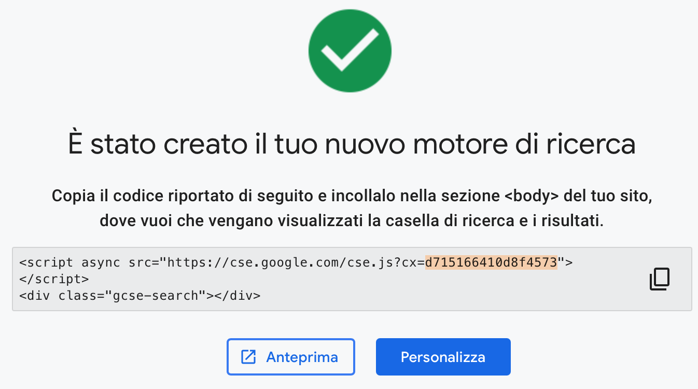
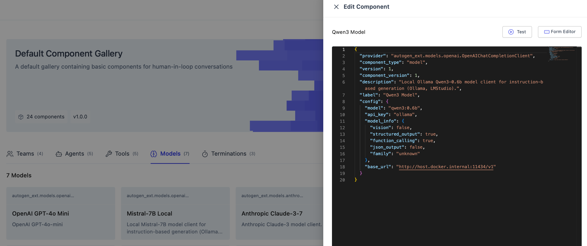
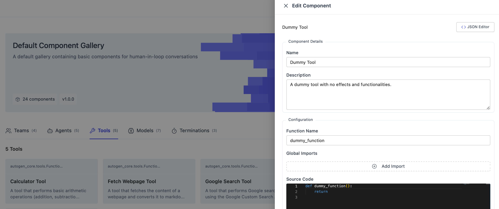
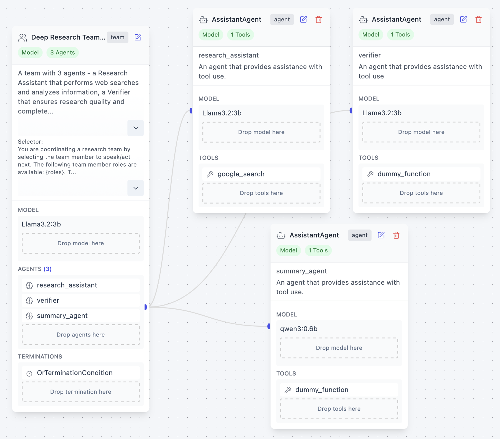

# 🤖 Deploy di un Chatbot LAM con AutoGen e Ollama

## 📋 Panoramica

In questa lezione analizziamo come creare e fare deployment di un chatbot LAM-based (Large Action Model) utilizzando AutoGen Studio e Ollama.

## 🎯 Cosa Costruiremo

- Un chatbot LAM completamente funzionale
- Integrazione con modelli locali tramite Ollama
- Interfaccia web tramite AutoGen Studio
- Capacità di ricerca web tramite Google Custom Search API

---

## 🛠️ Prerequisiti e Installazione

### 1. 📥 Installazione di Ollama

Ollama è il runtime che ci permetterà di eseguire modelli di AI in locale.

**Passo 1:** Scarica e installa Ollama
- Vai su https://ollama.com/
- Scarica la versione per il tuo sistema operativo
- Segui le istruzioni di installazione

**Passo 2:** Avvia il servizio Ollama
```bash
# Apri un nuovo terminale e avvia Ollama in background
ollama serve >/dev/null 2>&1 &
```

**Passo 3:** Scarica i modelli necessari
```bash
# Scarica il modello Qwen3 (leggero e veloce)
ollama pull qwen3:4b

# Opzionale: scarica anche Llama3.2 per avere più opzioni
ollama pull llama3.2:3b
```

---

## 🔑 Configurazione delle Credenziali Google

Per abilitare le funzionalità di ricerca web, dovrai configurare l'API di Google Custom Search.

### Parte 1: 🔐 Ottenere la Google API Key

#### Passo 1: Accesso alla Google Cloud Console
- 🌐 Vai su https://console.cloud.google.com/
- 👤 Accedi con il tuo account Google

#### Passo 2: Gestione del Progetto
- 🆕 **Se non hai progetti:** Clicca su "Crea progetto", inserisci un nome significativo (es. "AutoGen-LAM-Bot") e clicca "Crea"
- 📁 **Se hai già progetti:** Seleziona quello che vuoi utilizzare per questo chatbot

#### Passo 3: Abilitazione dell'API
- 📚 Nel menu laterale: "API e servizi" → "Libreria"
- 🔍 Cerca "Custom Search API"
- ✅ Seleziona l'API e premi "Abilita"

#### Passo 4: Creazione delle Credenziali
- 🔑 Vai su "API e servizi" → "Credenziali"
- ➕ Clicca "Crea credenziali" → "Chiave API"
- 💾 **IMPORTANTE:** Copia e salva la chiave generata in un posto sicuro

### Parte 2: 🔍 Ottenere il Google CSE ID

#### Passo 1: Accesso al Programmable Search Engine
- 🌐 Vai su https://programmablesearchengine.google.com/
- 👤 Accedi con lo stesso account Google utilizzato per l'API

#### Passo 2: Creazione del Motore di Ricerca
- ➕ Clicca su "Aggiungi"

#### Passo 3: Configurazione Avanzata
**Opzioni per "Siti da cercare":**
- 🌍 **Raccomandato:** Seleziona "Ricerca in tutto il web" per massima flessibilità
- 🎯 **Alternativa:** Inserisci domini specifici (es. wikipedia.org, stackoverflow.com)

#### Passo 4: Finalizzazione
- ✅ Clicca su "Crea"
- 📋 Annota il **Search Engine ID** che viene generato


*Figura: Processo di creazione del Custom Search Engine ID*

---

## 🐳 Deploy con Docker

### Configurazione del Container AutoGen

Creiamo l'immagine Docker con:
```bash
docker build -f build/Dockerfile -t autogen_image .
```

Utilizza il seguente comando per avviare AutoGen Studio in un container Docker:
```bash
docker run -d \
       --name autogen \
       -w /app \
       -v $(pwd):/app \
       -e GOOGLE_API_KEY="LA_TUA_API_KEY_QUI" \
       -e GOOGLE_CSE_ID="IL_TUO_CSE_ID_QUI" \
       -p 40000:8080 \
       autogen_image:latest \
       autogenstudio ui --host 0.0.0.0 --port 8080 --appdir /app/my_app
```

**⚠️ IMPORTANTE:** Sostituisci `LA_TUA_API_KEY_QUI` e `IL_TUO_CSE_ID_QUI` con le credenziali ottenute nei passaggi precedenti.

### 🌐 Accesso all'Interfaccia Web

Dopo aver avviato il container:
- 🖥️ Apri il browser e vai su http://localhost:40000
- 🎉 Dovresti vedere l'interfaccia di AutoGen Studio

---

## ⚙️ Configurazione dei Modelli

### 1. 📝 Aggiunta di Modelli Locali

Nell'interfaccia di AutoGen Studio:

**Navigazione:** Gallery → Models → "+ Add Model" → "Json Editor"

### 2. 🤖 Configurazione Modello Qwen3

Copia e incolla questa configurazione:

```json
{
  "provider": "autogen_ext.models.openai.OpenAIChatCompletionClient",
  "component_type": "model",
  "version": 1,
  "component_version": 1,
  "description": "Local Ollama Qwen3-0.6b model client per generazione basata su istruzioni.",
  "label": "Qwen3 Model",
  "config": {
    "model": "qwen3:4b",
    "api_key": "ollama",
    "model_info": {
      "vision": false,
      "structured_output": true,
      "function_calling": true,
      "json_output": false,
      "family": "unknown"
    },
    "base_url": "http://host.docker.internal:11434/v1"
  }
}
```

### 3. 🦙 Configurazione Modello Llama3.2 (Opzionale)

```json
{
  "provider": "autogen_ext.models.openai.OpenAIChatCompletionClient",
  "component_type": "model",
  "version": 1,
  "component_version": 1,
  "description": "Local Ollama Llama3.2 model client per generazione avanzata.",
  "label": "Llama3.2 Model",
  "config": {
    "model": "llama3.2:3b",
    "api_key": "ollama",
    "model_info": {
      "vision": false,
      "structured_output": true,
      "function_calling": true,
      "json_output": false,
      "family": "unknown"
    },
    "base_url": "http://host.docker.internal:11434/v1"
  }
}
```



*Figura: Interfaccia di configurazione del modello Ollama negli agenti - mostra come inserire la configurazione JSON*

### 4. ✅ Test della Configurazione

Dopo aver inserito la configurazione:
- 🧪 Clicca su "Test" per verificare la connessione
- ✅ Se tutto funziona, vedrai un messaggio di successo


---

## 🔧 Configurazione degli Agenti

### 1. 🛠️ Creazione di Funzioni e Tool

Per iniziare, creiamo una funzione dummy per verificare che il sistema funzioni.

📍 Nell'interfaccia AutoGen Studio: Gallery → Tools → "+ Add Tool"



*Figura: Processo di creazione di una funzione dummy per test - mostra l'interfaccia di inserimento del codice JSON*

### 2. 🤖 Assegnazione dei Modelli agli Agenti

Dopo aver creato i tool, configura gli agenti per utilizzare i modelli Ollama precedentemente configurati.

### 3. 🔍 Pipeline di Deep Research

Ecco come appare una pipeline completa di ricerca approfondita:


*Figura: Pipeline completa del DeepResearch LAM Agent - mostra la configurazione multi-agente per ricerca approfondita*

---

## 🌐 Creazione della Pipeline Google LAM

### 📋 Panoramica della Pipeline

La pipeline Google LAM rappresenta il cuore del sistema, combinando capacità di ricerca web con ragionamento avanzato. Questa sezione ti guiderà nella creazione di una pipeline completa.

### 🔧 Configurazione della Pipeline

#### Passo 1: Struttura Multi-Agente
La pipeline Google LAM utilizza una struttura a più agenti specializzati:

- **🔍 Search Agent:** Responsabile delle ricerche web
- **📊 Analysis Agent:** Analizza e filtra i risultati
- **📝 Summary Agent:** Crea riassunti e risposte finali

#### Passo 2: Workflow della Pipeline
1. **Input Processing:** L'utente inserisce una query
2. **Search Execution:** Il Search Agent esegue ricerche mirate
3. **Data Analysis:** L'Analysis Agent processa i risultati
4. **Response Generation:** Il Summary Agent formula la risposta finale

#### Passo 3: Configurazione Pratica
```json
{
  "name": "Google LAM Pipeline",
  "description": "Pipeline avanzata per ricerca e analisi web",
  "agents": [
    {
      "role": "search_specialist",
      "model": "Qwen3 Model",
      "tools": ["Google Search Tool"],
      "instructions": "Esegui ricerche web mirate e raccogli informazioni rilevanti"
    },
    {
      "role": "analyst",
      "model": "Qwen3 Model", 
      "instructions": "Analizza i risultati di ricerca e identifica informazioni chiave"
    },
    {
      "role": "summarizer",
      "model": "Qwen3 Model",
      "instructions": "Crea riassunti completi e risposte strutturate"
    }
  ]
}
```

#### 🎯 Vantaggi della Pipeline Google LAM
- **🚀 Ricerca Intelligente:** Utilizza algoritmi avanzati per query ottimizzate
- **🧠 Ragionamento Contestuale:** Comprende il contesto delle richieste
- **📈 Scalabilità:** Gestisce query semplici e complesse
- **🔄 Feedback Loop:** Migliora le risposte basandosi sui risultati precedenti

---

## 📚 Risorse Aggiuntive

- 📖 [Documentazione AutoGen](https://github.com/microsoft/autogen)
- 🐙 [Repository Ollama](https://github.com/ollama/ollama)


---

## Author
`Lorenzo Molfetta`

contacts: lorenzo.molfetta@unibo.it